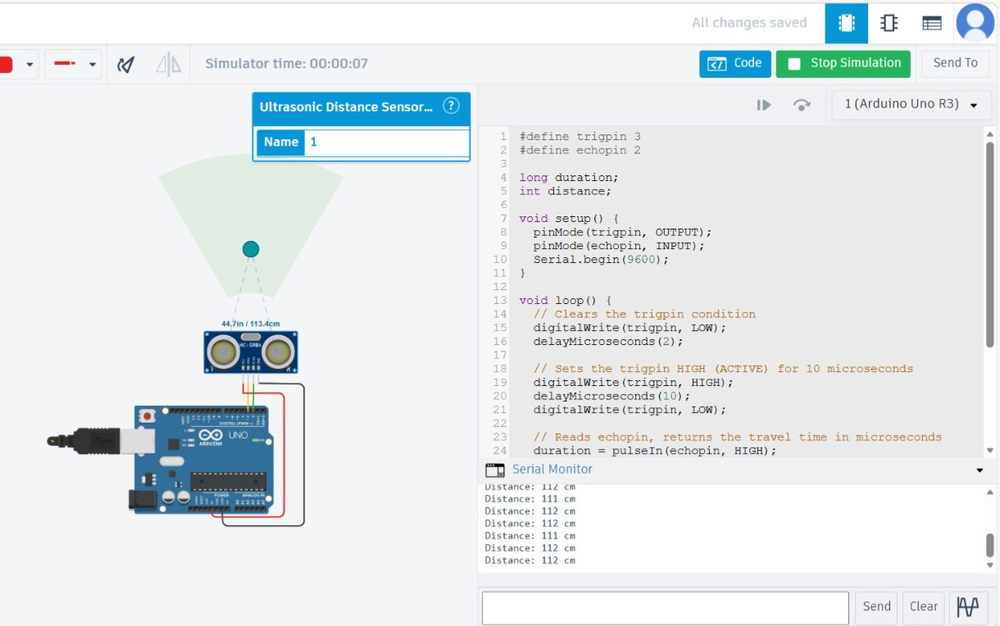

# IoT Smart Transportation - Obstacle Detection
A hardware-software integration project developed to simulate "Sense and Avoid" logic for smart vehicles.

# Project Overview
This system utilizes an HC-SR04 Ultrasonic Sensor to calculate the proximity of objects. It was built as a proof-of-concept for autonomous vehicle safety systems, focusing on real-time data acquisition and processing.

# Technical Details
- **Hardware Simulation:** Arduino Uno R3, HC-SR04 Ultrasonic Sensor.
- **Logic:** C++ code calculates distance by measuring the travel time of ultrasonic sound waves.
- **Environment:** Verified and tested via Tinkercad Circuits.

##  Key Features
- **Real-time Monitoring:** Prints exact distance in centimeters to the Serial Monitor.
- **Precision Logic:** Uses `pulseIn()` for high-accuracy timing.
- **Dynamic Simulation:** Verified circuit performance with moving obstacles.

##  Future Roadmap
- **Braking Logic:** Integrating a DC Motor to stop automatically when an object is < 10cm.
- **Visual Feedback:** Adding an I2C LCD to display warnings without a computer.

##  Simulation Preview

